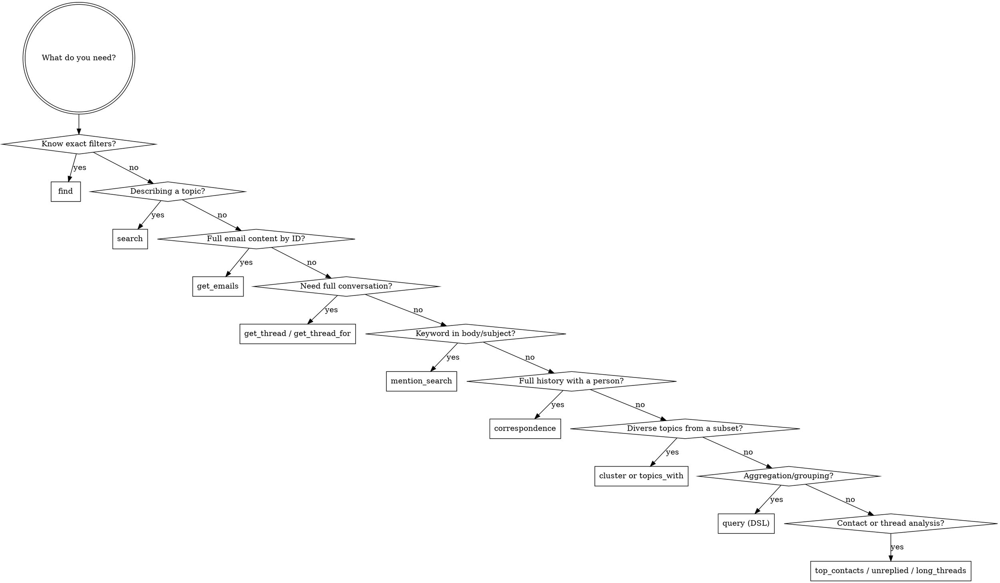

# Using MailDB

MailDB is a local email database with semantic search, exposed as an MCP server. All data stays on the user's machine (PostgreSQL + pgvector + Ollama). All interactions use MCP tools — no Python imports needed.

## Key Concept: Headers First, Bodies On Demand

List tools return **headers + `body_length`** by default — no `body_text`. This keeps responses small and context-efficient. To read email bodies, use `get_emails` with specific message IDs.

**Two-step workflow:**
```
# Step 1: Search (lightweight — headers only)
result = find(sender="alice@example.com", limit=50)
# result = {total: 147, offset: 0, limit: 50, results: [{subject, body_length, ...}, ...]}

# Step 2: Fetch bodies for emails you need
emails = get_emails(ids=["msg-1@example.com", "msg-2@example.com"])
# emails = {total: 2, results: [{subject, body_text, ...}, ...]}
```

Override with `fields: ["body_text", ...]` on any list tool if you need bodies inline.

## Choosing a Tool



## Response Shape

All list tools return a wrapper with pagination metadata:

```json
{"total": 147, "offset": 0, "limit": 50, "results": [...]}
```

- `total` — full count matching filters (ignoring limit/offset)
- `results` — the email objects (headers + `body_length`, no `body_text` by default)

**Exceptions:** `get_thread` and `get_thread_for` return flat lists. `query` returns flat lists.

## MCP Tools Quick Reference

### Search & Retrieval

| Tool | Use When |
|------|----------|
| `find(sender, sender_domain, recipient, after, before, has_attachment, subject_contains, labels, max_to, max_cc, max_recipients, direct_only, limit, offset, order, fields)` | Exact attribute filtering |
| `search(query, ...same filters as find..., limit, offset, fields)` | Natural language topic search (needs Ollama) |
| `get_emails(ids, body_max_chars, fields)` | Fetch full emails by message_id — includes `body_text` by default |
| `get_thread(thread_id, fields)` | Full conversation by thread ID |
| `get_thread_for(message_id, fields)` | Find thread containing a message |
| `correspondence(address, after, before, limit, offset, order, fields)` | Bidirectional email history with a person |
| `mention_search(text, sender, sender_domain, after, before, max_to, max_cc, max_recipients, direct_only, limit, offset, fields)` | Keyword search in body/subject (no Ollama) |

### Analysis

| Tool | Use When | Needs `user_email` |
|------|----------|--------------------|
| `top_contacts(period, limit, offset, direction, group_by, exclude_domains)` | Most frequent correspondents; `group_by="domain"` for domain view | Yes |
| `topics_with(sender or sender_domain, limit, offset, fields)` | Diverse topic sample with a contact | No |
| `unreplied(direction, recipient, after, before, sender, sender_domain, max_to, max_cc, max_recipients, direct_only, limit, offset, fields)` | Messages with no reply; `direction="outbound"` for sent | Yes |
| `long_threads(min_messages, after, participant, limit, offset)` | Threads exceeding message count | No |
| `cluster(where or message_ids, limit, offset, fields)` | Diverse topic extraction from any subset | No |
| `query(spec)` | DSL: aggregation, grouping, custom selects | No |

### Recipient Count Filters

Available on `find`, `search`, `mention_search`, `unreplied`, `correspondence`:

| Parameter | Type | Effect |
|-----------|------|--------|
| `max_to` | int | Max recipients in To field |
| `max_cc` | int | Max recipients in CC field |
| `max_recipients` | int | Max total across To + CC + BCC |
| `direct_only` | bool | Shorthand for `max_to=1, max_cc=0` (BCC unconstrained) |

`direct_only` cannot be combined with `max_to` or `max_cc`.

### Common Parameters

| Parameter | Type | Notes |
|-----------|------|-------|
| `limit` | int | Max results (defaults vary per tool) |
| `offset` | int | Skip first N results for pagination (default 0) |
| `fields` | list[str] | Override default field selection. Valid: `id`, `message_id`, `thread_id`, `subject`, `sender_name`, `sender_address`, `sender_domain`, `recipients`, `date`, `body_text`, `body_length`, `body_truncated`, `has_attachment`, `attachments`, `labels`, `in_reply_to`, `references`, `created_at` |
| `after` | str | ISO date, inclusive (e.g. `"2025-01-01"`) |
| `before` | str | ISO date, exclusive |
| `order` | str | `"date DESC"`, `"date ASC"`, `"sender_address ASC"`, `"sender_address DESC"` |

### Default vs Explicit Fields

**List tools** (find, search, correspondence, etc.) return by default:
- All header fields + `body_length` (character count of body)
- **No `body_text`** — use `get_emails` or pass `fields: ["body_text", ...]` to override

**`get_emails`** returns by default:
- All fields **including `body_text`** — this is the body retrieval tool

### Body Truncation (`get_emails` only)

```
get_emails(ids=["msg@example.com"], body_max_chars=300)
→ {total: 1, results: [{body_text: "First 300 chars...", body_truncated: true, ...}]}
```

When `body_max_chars` is set and body exceeds it, `body_text` is truncated with `...` and `body_truncated: true` is added.

### Pagination

Use `offset` with `limit` to page through results. Check `total` to know if more exist:

```
result = find(sender_domain="stripe.com", limit=10, offset=0)
# result["total"] = 47 → 37 more results available
result2 = find(sender_domain="stripe.com", limit=10, offset=10)  # Page 2
```

## Common Patterns

**Search headers, then fetch bodies for analysis:**
```
result = find(sender="disney@postmates.com", direct_only=True, limit=100)
# result = {total: 29, results: [{message_id: "abc@...", subject: "...", body_length: 512, ...}, ...]}
ids = [e["message_id"] for e in result["results"]]
emails = get_emails(ids=ids)
# Now analyze emails["results"] which include body_text
```

**Skim bodies first, then fetch full for interesting ones:**
```
previews = get_emails(ids=all_ids, body_max_chars=200)
interesting = [e["message_id"] for e in previews["results"] if "budget" in e["body_text"]]
full = get_emails(ids=interesting)
```

**Find + expand to thread:**
```
result = find(sender_domain="stripe.com", after="2025-01-01", limit=5)
thread = get_thread(thread_id=result["results"][0]["thread_id"])
```

**Direct messages only (no CC, single To recipient):**
```
result = find(sender="alice@example.com", direct_only=True)
```

**Small group conversations (max 3 total recipients):**
```
result = find(sender_domain="team.com", max_recipients=3)
```

**Chain cluster with prior results:**
```
result = find(sender_domain="stripe.com", limit=50)
ids = [e["message_id"] for e in result["results"]]
cluster(message_ids=ids, limit=5, fields=["subject", "body_text", "date"])
```

## DSL Quick Reference (query tool)

| Key | Description |
|-----|-------------|
| `from` | `"emails"` (default), `"sent_to"`, `"email_labels"` |
| `select` | `[{field: "col"}, {count: "*", as: "n"}, {date_trunc: "month", field: "date", as: "p"}]` |
| `where` | `{field: "col", op: value}` or `{and/or/not: [...]}` |
| `group_by` | `["col1", "col2"]` |
| `having` | Same as where, on aliases |
| `order_by` | `[{field: "col", dir: "desc"}]` |
| `limit` | Max 1000 (default 50) |
| `offset` | For pagination |

**Operators:** eq, neq, gt, gte, lt, lte, ilike, not_ilike, in, not_in, contains, is_null

## Things to Know

- **No Python imports needed.** All interactions via MCP tools. Responses are JSON dicts.
- **Headers by default.** List tools exclude `body_text` and include `body_length` instead. Use `get_emails` for bodies.
- **`total` tells you the full count.** Check `result["total"]` to know if you've fetched everything or need to paginate.
- **`user_email` required** for `unreplied` and `top_contacts`. Set via `MAILDB_USER_EMAIL` env var.
- **`search` needs Ollama running.** `find`, `mention_search`, and `correspondence` work without it.
- **`query` DSL** has a 5s timeout and 1000-row hard cap. Returns flat lists (no wrapper).
- **`cluster` chains well** with other tools via `message_ids` — pass IDs from any prior result.
- **Null-date emails** (e.g. Google Chat transcripts) are excluded from `unreplied` results automatically.
