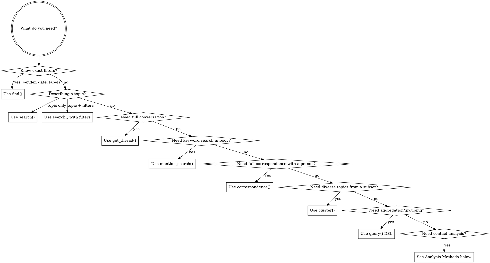

# Using MailDB

MailDB is a local email database with semantic search. All data stays on the user's machine (PostgreSQL + pgvector + Ollama).

## Choosing a Method



## Quick Reference

### Core Query Methods

| Method | Returns | Use When |
|--------|---------|----------|
| `find(**filters)` | `list[Email]` | Exact attribute filtering (sender, date, labels, attachments) |
| `search(query, **filters)` | `list[SearchResult]` | Natural language topic search, optionally combined with filters |
| `get_thread(thread_id)` | `list[Email]` | Retrieve full conversation (chronological order) |
| `get_thread_for(message_id)` | `list[Email]` | Find which thread contains a message, then return it |
| `correspondence(address, **filters)` | `list[Email]` | Full bidirectional email history with a person |
| `mention_search(text, **filters)` | `list[Email]` | Keyword search in body/subject (no Ollama needed) |

### Analysis Methods

| Method | Returns | Use When | Requires `user_email` |
|--------|---------|----------|-----------------------|
| `top_contacts(period, limit, direction, group_by, exclude_domains)` | `list[dict]` with `{address, count}` | Most frequent correspondents; supports `group_by="domain"` and `exclude_domains` | Yes |
| `topics_with(sender\|sender_domain)` | `list[Email]` | Diverse topic sample with a contact | No |
| `unreplied(after, before, sender, direction, recipient)` | `list[Email]` | Inbound (or outbound with `direction="outbound"`) messages with no reply; filter by `recipient` | Yes |
| `long_threads(min_messages, after, participant)` | `list[dict]` | Threads exceeding message count; filter by `participant` | No |
| `cluster(where\|message_ids, limit)` | `list[Email]` | Diverse topic extraction from any subset | No |
| `query(spec)` | `list[dict]` | Generalized DSL: aggregation, grouping, filtering | No |

### Shared Filter Parameters

All of `find()` and `search()` accept these filters:

| Parameter | Type | Example | Notes |
|-----------|------|---------|-------|
| `sender` | `str` | `"alice@acme.com"` | Exact email address |
| `sender_domain` | `str` | `"acme.com"` | All senders at domain |
| `recipient` | `str` | `"bob@acme.com"` | In To/CC/BCC |
| `after` | `str` | `"2025-01-15"` | ISO date string, inclusive |
| `before` | `str` | `"2025-03-01"` | ISO date string, exclusive |
| `has_attachment` | `bool` | `True` | Filter by attachment presence |
| `subject_contains` | `str` | `"invoice"` | Case-insensitive substring |
| `labels` | `list[str]` | `["INBOX", "Finance"]` | Array containment (AND) |
| `limit` | `int` | `50` (find) / `20` (search) | Max results |
| `order` | `str` | `"date DESC"` | find() only: `date DESC/ASC`, `sender_address DESC/ASC` |

### Return Types

**`Email` fields:** `id`, `message_id`, `thread_id`, `subject`, `sender_name`, `sender_address`, `sender_domain`, `recipients` (with `.to`, `.cc`, `.bcc`), `date`, `body_text`, `body_html`, `has_attachment`, `attachments` (list of `{filename, content_type, size}`), `labels`, `in_reply_to`, `references`

**`SearchResult` fields:** `email` (an `Email`), `similarity` (float 0-1, higher = more relevant)

## Common Patterns

### Find + expand to thread
```python
from maildb import MailDB
db = MailDB()
emails = db.find(sender_domain="stripe.com", after="2025-01-01", has_attachment=True)
if emails:
    thread = db.get_thread(emails[0].thread_id)
```

### Semantic search + thread context
```python
results = db.search("budget concerns", sender_domain="finance.acme.com", limit=5)
if results:
    best = results[0]  # highest similarity
    thread = db.get_thread(best.email.thread_id)
```

### Via MCP (no code needed)
When the maildb MCP server is running, all methods are available as tools. The MCP server returns JSON dicts (not dataclasses), with embeddings stripped.

## DSL Quick Reference (query tool)

| Key | Description |
|-----|-------------|
| `from` | `"emails"` (default), `"sent_to"`, `"email_labels"` |
| `select` | `[{field: "col"}, {count: "*", as: "n"}, {date_trunc: "month", field: "date", as: "p"}]` |
| `where` | `{field: "col", op: value}` or `{and/or/not: [...]}` |
| `group_by` | `["col1", "col2"]` |
| `having` | Same as where, on aliases |
| `order_by` | `[{field: "col", dir: "desc"}]` |
| `limit` | Max 1000 (default 50) |

**Operators:** eq, neq, gt, gte, lt, lte, ilike, in, not_in, contains, is_null

**Example:**
```python
db.query({"from": "sent_to", "select": [{"field": "recipient_domain"}, {"count": "*", "as": "n"}], "group_by": ["recipient_domain"], "order_by": [{"field": "n", "dir": "desc"}], "limit": 10})
```

## MCP Server Setup

**Run:** `uv run --directory /path/to/maildb python -m maildb`

**Config for claude_desktop_config.json:**
```json
{
  "mcpServers": {
    "maildb": {
      "command": "uv",
      "args": ["run", "--directory", "/path/to/maildb", "python", "-m", "maildb"],
      "env": {
        "MAILDB_DATABASE_URL": "postgresql://maildb@localhost:5432/maildb",
        "MAILDB_USER_EMAIL": "you@example.com"
      }
    }
  }
}
```

The `env` block is optional if the project has a `.env` file — `uv run --directory` sets cwd so pydantic-settings finds it.

## Importing Email Data

```bash
# Full pipeline: split -> parse -> index -> embed
uv run python -m maildb.ingest /path/to/emails.mbox

# Skip embedding (faster, but no semantic search)
uv run python -m maildb.ingest /path/to/emails.mbox --skip-embed

# Check progress
uv run python -m maildb.ingest status

# Reset specific phase
uv run python -m maildb.ingest reset --phase embed --yes
```

## Things to Know

- **No "team" concept.** Filter by `sender_domain` for company/team, or `sender` for individuals. For fuzzy groups, use semantic search — the query vector includes sender context.
- **`user_email` required** for `unreplied()` and `top_contacts()`. Set via `MAILDB_USER_EMAIL` env var.
- **Dates are ISO strings.** Pass `"2025-01-15"`, not datetime objects.
- **`search()` needs Ollama running** to embed the query. `find()`, `mention_search()`, and `correspondence()` work without it.
- **`query()` DSL** has a 5s timeout and a 1000-row hard cap.
- **`cluster()` chains well** with other tools via the `message_ids` parameter — pass IDs from any prior result set.
- **Embedding model:** nomic-embed-text (768 dims) via local Ollama. No external API calls.
