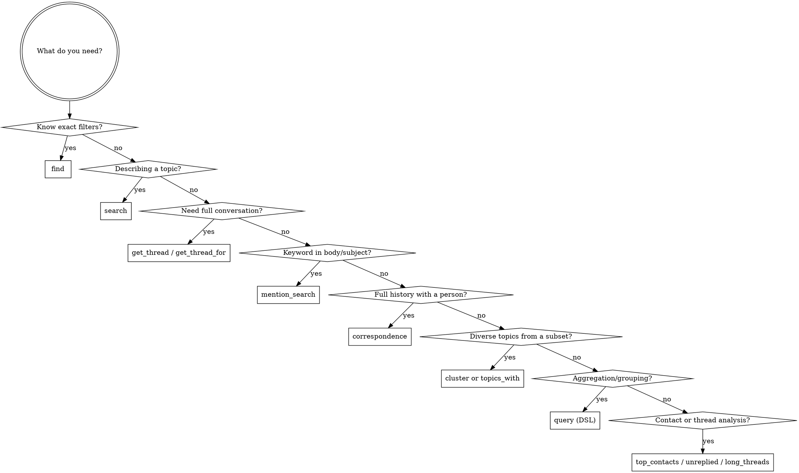

# Using MailDB

MailDB is a local email database with semantic search, exposed as an MCP server. All data stays on the user's machine (PostgreSQL + pgvector + Ollama). All interactions use MCP tools — no Python imports needed.

## Choosing a Tool



## MCP Tools Quick Reference

### Search & Retrieval

| Tool | Use When |
|------|----------|
| `find(sender, sender_domain, recipient, after, before, has_attachment, subject_contains, labels, limit, offset, order, fields)` | Exact attribute filtering |
| `search(query, sender, sender_domain, recipient, after, before, has_attachment, subject_contains, labels, limit, offset, fields)` | Natural language topic search (needs Ollama) |
| `get_thread(thread_id, fields)` | Full conversation by thread ID |
| `get_thread_for(message_id, fields)` | Find thread containing a message |
| `correspondence(address, after, before, limit, offset, order, fields)` | Bidirectional email history with a person |
| `mention_search(text, sender, sender_domain, after, before, limit, offset, fields)` | Keyword search in body/subject (no Ollama) |

### Analysis

| Tool | Use When | Needs `user_email` |
|------|----------|--------------------|
| `top_contacts(period, limit, offset, direction, group_by, exclude_domains)` | Most frequent correspondents; `group_by="domain"` for domain view | Yes |
| `topics_with(sender or sender_domain, limit, offset, fields)` | Diverse topic sample with a contact | No |
| `unreplied(direction, recipient, after, before, sender, sender_domain, limit, offset, fields)` | Messages with no reply; `direction="outbound"` for sent | Yes |
| `long_threads(min_messages, after, participant, limit, offset)` | Threads exceeding message count | No |
| `cluster(where or message_ids, limit, offset, fields)` | Diverse topic extraction from any subset | No |
| `query(spec)` | DSL: aggregation, grouping, custom selects | No |

### Common Parameters

| Parameter | Type | Notes |
|-----------|------|-------|
| `limit` | int | Max results (defaults vary per tool) |
| `offset` | int | Skip first N results for pagination (default 0) |
| `fields` | list[str] | Return only these fields. Valid: `id`, `message_id`, `thread_id`, `subject`, `sender_name`, `sender_address`, `sender_domain`, `recipients`, `date`, `body_text`, `has_attachment`, `attachments`, `labels`, `in_reply_to`, `references`, `created_at` |
| `after` | str | ISO date, inclusive (e.g. `"2025-01-01"`) |
| `before` | str | ISO date, exclusive |
| `order` | str | `"date DESC"`, `"date ASC"`, `"sender_address ASC"`, `"sender_address DESC"` |

### Response Shape

All tools return JSON dicts. `embedding` and `body_html` are always excluded from responses.

When `fields` is omitted, all available fields are returned. When specified, only those fields appear:

```
find(sender_domain="stripe.com", fields=["subject", "sender_address", "date"])
→ [{"subject": "...", "sender_address": "...", "date": "..."}, ...]
```

`search` returns `[{"email": {...}, "similarity": 0.95}, ...]` — `similarity` is always included; `fields` applies to the nested email.

### Pagination

Use `offset` with `limit` to page through results:

```
find(sender_domain="stripe.com", limit=10, offset=0)   # Page 1
find(sender_domain="stripe.com", limit=10, offset=10)  # Page 2
```

## Common Patterns

**Find + expand to thread:**
```
emails = find(sender_domain="stripe.com", after="2025-01-01", limit=5)
thread = get_thread(thread_id=emails[0]["thread_id"])
```

**Semantic search + thread context:**
```
results = search(query="budget concerns", sender_domain="finance.acme.com", limit=5)
thread = get_thread(thread_id=results[0]["email"]["thread_id"])
```

**Lightweight browsing (minimal fields):**
```
find(sender_domain="github.com", fields=["subject", "date", "sender_address"], limit=20)
```

**Chain cluster with prior results:**
```
emails = find(sender_domain="stripe.com", limit=50)
ids = [e["message_id"] for e in emails]
cluster(message_ids=ids, limit=5, fields=["subject", "body_text", "date"])
```

## DSL Quick Reference (query tool)

| Key | Description |
|-----|-------------|
| `from` | `"emails"` (default), `"sent_to"`, `"email_labels"` |
| `select` | `[{field: "col"}, {count: "*", as: "n"}, {date_trunc: "month", field: "date", as: "p"}]` |
| `where` | `{field: "col", op: value}` or `{and/or/not: [...]}` |
| `group_by` | `["col1", "col2"]` |
| `having` | Same as where, on aliases |
| `order_by` | `[{field: "col", dir: "desc"}]` |
| `limit` | Max 1000 (default 50) |
| `offset` | For pagination |

**Operators:** eq, neq, gt, gte, lt, lte, ilike, not_ilike, in, not_in, contains, is_null

## Things to Know

- **No Python imports needed.** All interactions via MCP tools. Responses are JSON dicts.
- **`user_email` required** for `unreplied` and `top_contacts`. Set via `MAILDB_USER_EMAIL` env var.
- **`search` needs Ollama running.** `find`, `mention_search`, and `correspondence` work without it.
- **`query` DSL** has a 5s timeout and 1000-row hard cap.
- **`cluster` chains well** with other tools via `message_ids` — pass IDs from any prior result.
- **Use `fields`** to reduce response size. Most queries only need `subject`, `sender_address`, `date`.
- **Null-date emails** (e.g. Google Chat transcripts) are excluded from `unreplied` results automatically.
